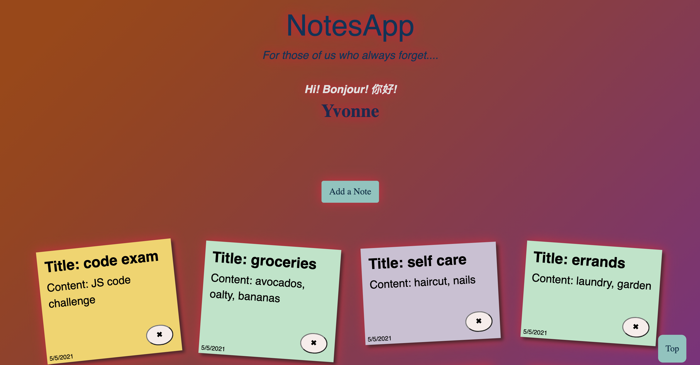

<!-- PROJECT LOGO -->

<br />
<p align="center">
  <a href="https://github.com/misswonder/NotesApp">
    
  </a>

  <h3 align="center">NotesApp</h3>

  <p align="center">
    OUR MISSION: An application that allows users to take and delete notes as they need.  
    <br />
    <br />
    <a href="https://www.youtube.com/watch?v=QuEI20XRdAA&t=11s">View Demo</a>
  </p>
</p>

<!-- TABLE OF CONTENTS -->
<details open="open">
  <summary>Table of Contents</summary>
  <ol>
    <li>
      <a href="#about-the-project">About The Project</a>
      <ul>
        <li><a href="#built-with">Built With</a></li>
      </ul>
    </li>
    <li>
      <a href="#installation">Installation</a>
    </li>
    <li><a href="#contact">Contact</a></li>
  </ol>
</details>

<!-- ABOUT THE PROJECT -->

## About The Project



Fashop is a full-stack web application that allows users to take notes. Users can login an account, take, update and delete notes as they need.  

Key Features:

- Desktop app
- Full CRUD capability options
- Ability to create a new note
- Ability to read all the notes from an user
- Ability to update an exisiting note 
- Ability to delete an exisiting note 

### Built With

- [JavaScript](https://github.com/topics/vanilla-js)
- [React Bootstrap](https://react-bootstrap.github.io/)
- [Ruby on Rails](http://rubyonrails.org/)
- [Postgres](https://www.postgresql.org/)

### Installation

1. Clone the repo
   ```sh
   git clone git@github.com:misswonder/Fashop-frontend.git
   ```
2. Navigate to NotesApp backend and Install GEM packages
   ```sh
   bundle install
   ```
3. Run PostgreSQL database
   ```sh
   rails db:create
   rails db:migrate
   rails db:seed
   ```  
4. Start the Rails app
   ```sh
   rails s (defaulted port: http://localhost:3000) 
   ```  
5. Navigate to NotesApp frontend and Start the JavaScript app
   ```sh
   open index.html
   ```
<!-- CONTACT -->

## Contact

Project Link: [https://github.com/misswonder/NotesApp](https://github.com/misswonder/NotesApp)   
